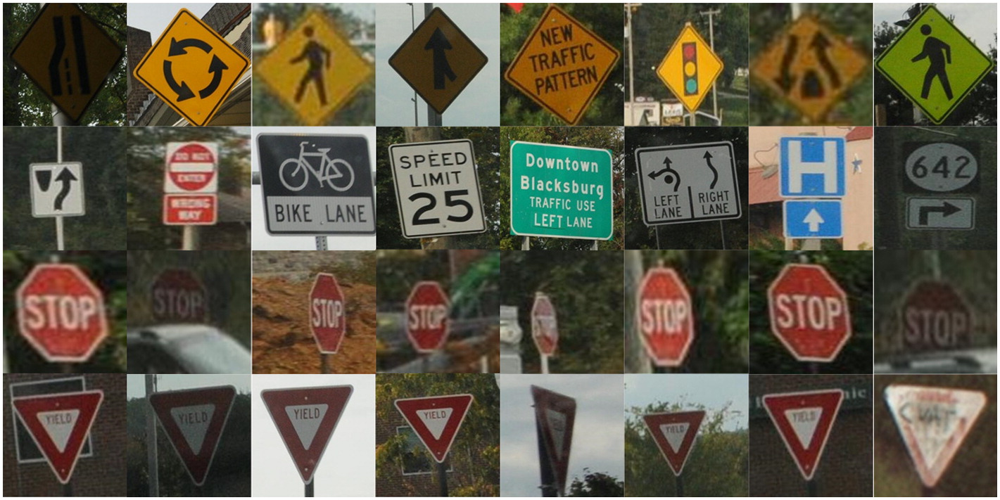

# Traffic

The goal of this project is, using TensorFlow, build a neural network to classify road signs based on an image of those signs.
functionality of project can be seen here:[Youtube video link](https://youtu.be/-h8NrvDQP5Q)

[Download dataset from here](https://cdn.cs50.net/ai/2020/x/projects/5/gtsrb.zip)
[Download small dataset from here](https://cdn.cs50.net/ai/2020/x/projects/5/gtsrb-small.zip)
Move the resulting gtsrb directory inside of your traffic directory
Requirements:
opencv-python
scikit-learn
tensorflow
